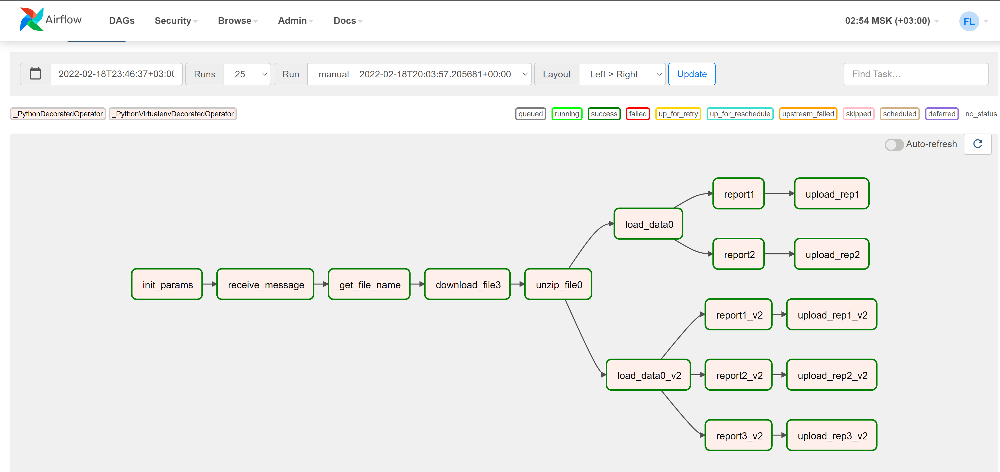
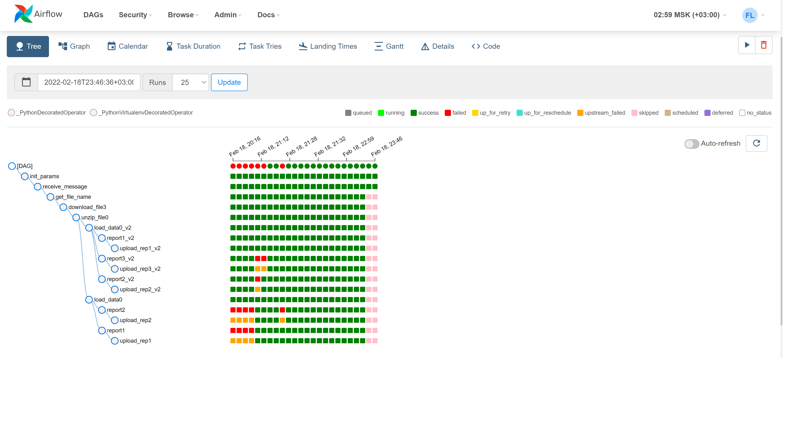

##Описание решения
Дипломная работа выполнена в DAG файле `advde3_dag.py`

###Графическое представление пайплайна (Граф)

### Особенности структуры данных
#### Формат без поля "gender"
        ride_id,rideable_type,started_at,ended_at,start_station_name,start_station_id,end_station_name,end_station_id,start_lat,start_lng,end_lat,end_lng,member_casual
        69D25C9A2BF4CD1E,classic_bike,2022-01-06 18:58:23,2022-01-06 19:02:31,Madison St & 1 St,HB402,6 St & Grand St,HB302,40.73879,-74.0393,40.744397833095604,-74.03450086712837,casual

#### Формат полем "gender". Ветка обработки *_V2
        "tripduration","starttime","stoptime","start station id","start station name","start station latitude","start station longitude","end station id","end station name","end station latitude","end station longitude","bikeid","usertype","birth year","gender"
        152,"2018-10-01 07:44:41.4170","2018-10-01 07:47:14.2960",3183,"Exchange Place",40.7162469,-74.0334588,3639,"Harborside",40.7192517,-74.034234,15302,"Subscriber",1971,2

### DAG's tasks
- `init_params` - инициализация
- `receive_message` - опрос SQS
- `get_file_name` - парсинг сообщения
- `download_file3` - загрузка файла из бакета
- `unzip_file0` - распаковка архива
- `load_data0` - загрузка данных в Clickhouse
- `report1` - отчет (1) "Количество поездок в день"
- `upload_rep1` - выгрузка отчета 1 в специальный бакет
- `report2` - отчет (2) "Средняя продолжительность поездок в день"
- `upload_rep2` - выгрузка отчета 2 в специальный бакет
- `load_data0_v2` - загрузка данных в Clickhouse (формат №2)
- `report1_v2` - формирование отчета (1) "Количество поездок в день"
- `upload_rep1_v2` - выгрузка отчета 1 в специальный бакет
- `report2_v2` - формирование отчета 2 "Средняя продолжительность поездок в день"
- `upload_rep2_v2` - выгрузка отчета 2 в специальный бакет
- `report3_v2` - формирование отчета 3 "Распределение поездок пользователей, разбитых по категории «gender»"
- `upload_rep3_v2` - выгрузка отчета 3 в специальный бакет

### Представление пайплайна в режиме "Tree"

